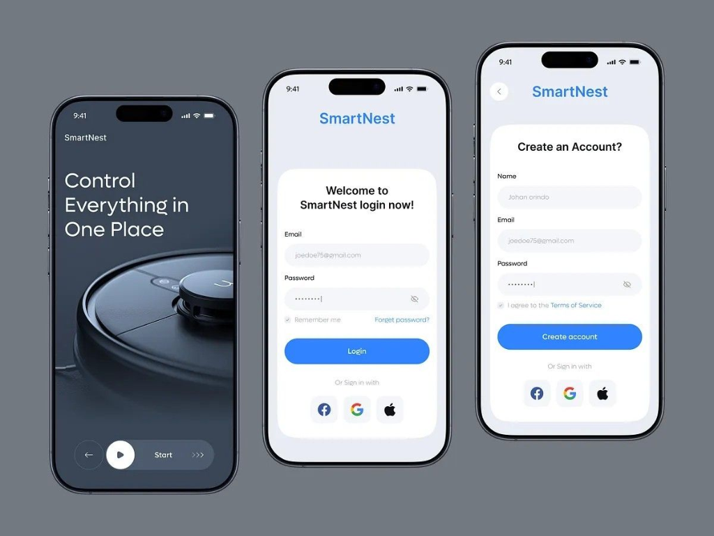
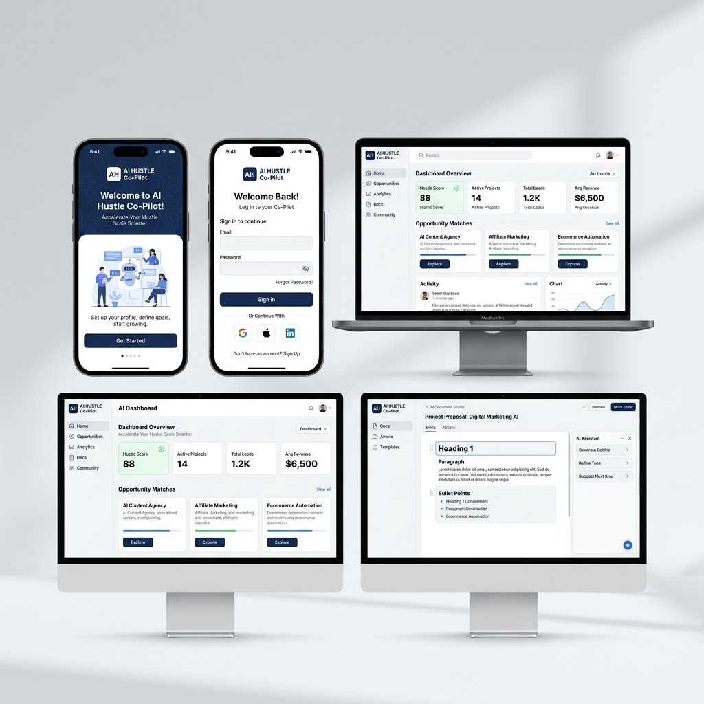
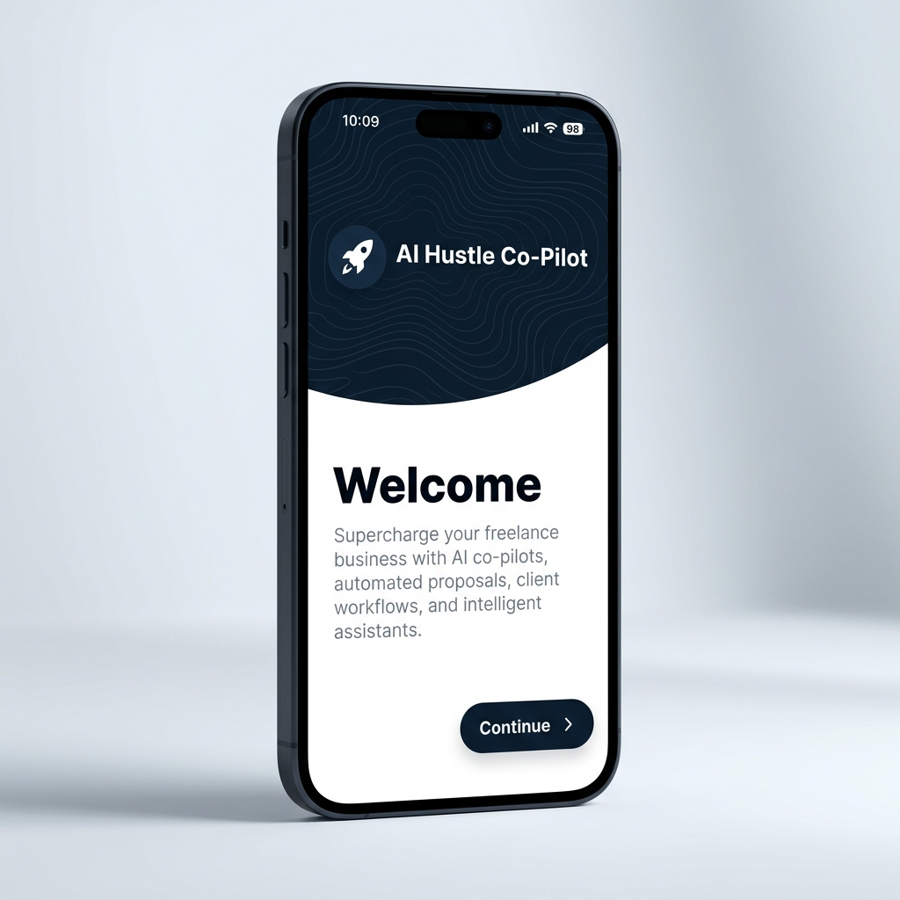
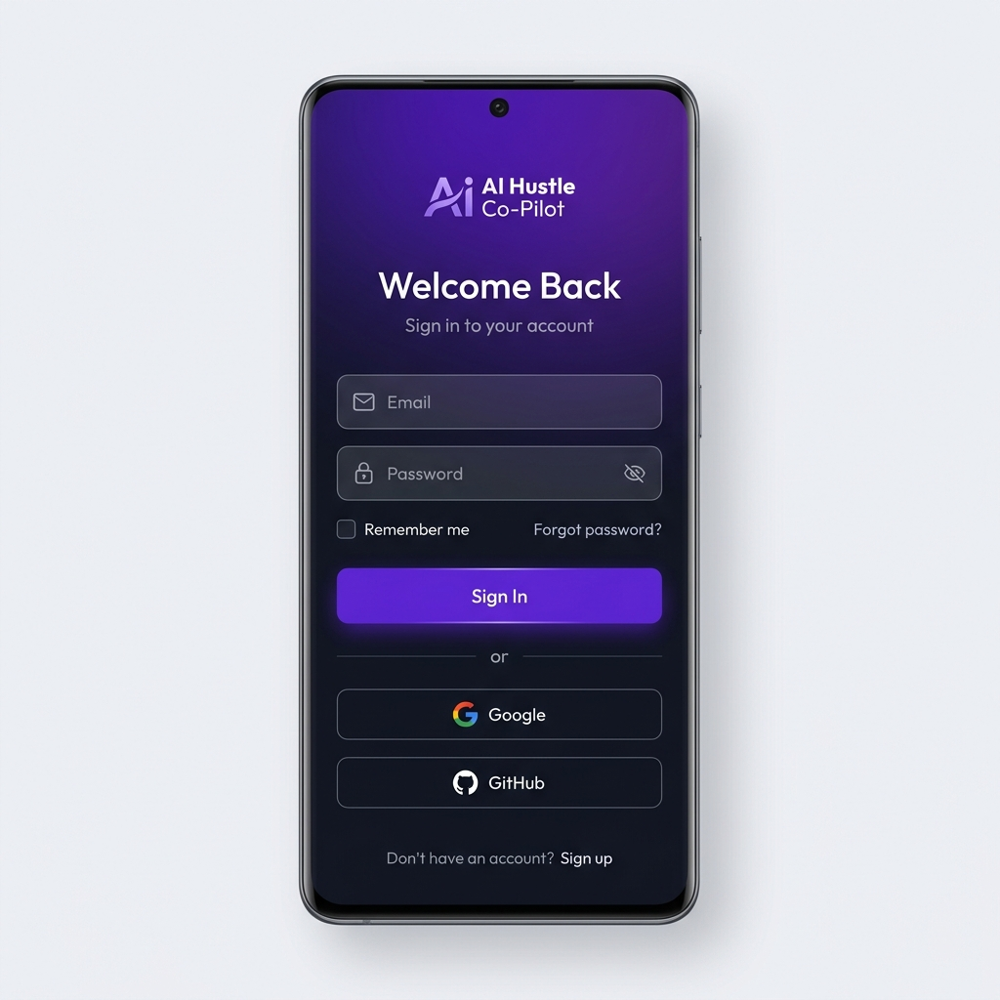
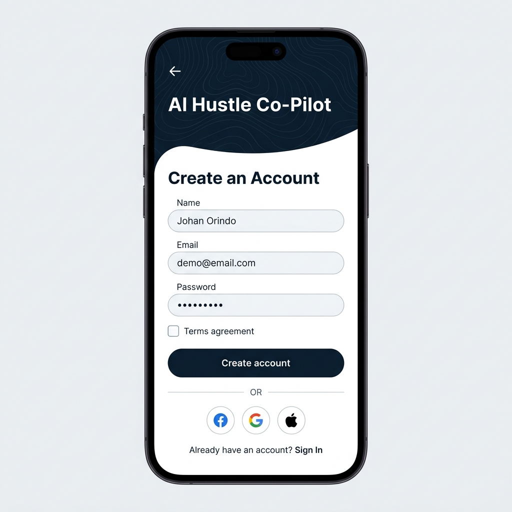
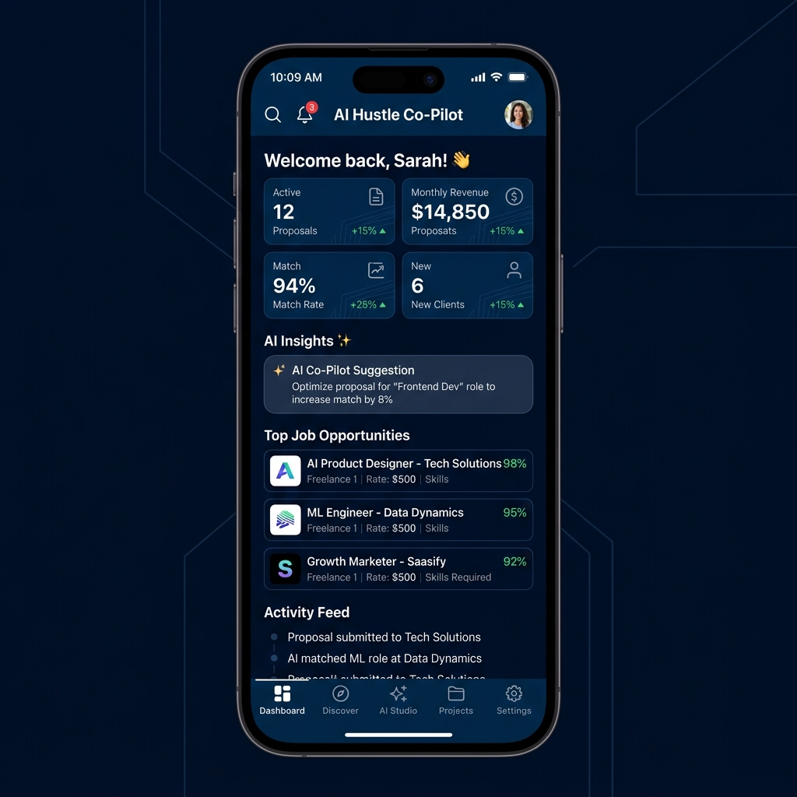

# 🚀 AI Hustle Co-Pilot

<p align="center">
  
</p>

<p align="center">
  <strong>Your AI-Powered Freelance Command Center</strong>
</p>

<p align="center">
  <em>Discover opportunities. Generate winning proposals. Manage your project pipeline. Create smart AI documents — all powered by artificial intelligence.</em>
</p>

<p align="center">
  <a href="#-screenshots">Screenshots</a> •
  <a href="#-features">Features</a> •
  <a href="#-architecture">Architecture</a> •
  <a href="#-getting-started">Getting Started</a> •
  <a href="#-tech-stack">Tech Stack</a> •
  <a href="#-documentation">Documentation</a> •
  <a href="#-contributing">Contributing</a>
</p>

---

## 📋 Overview

**AI Hustle Co-Pilot** is a commercial-grade, enterprise Flutter mobile & cross-platform application that empowers freelancers and agencies with AI-driven tools to discover high-value opportunities, execute multi-agent AI tasks, manage project knowledge bases, generate winning proposals, and compile structured documents in real-time.

Built strictly adhering to **Clean Architecture**, **Feature-First modularization**, **Riverpod state management**, and a custom **Material 3 Enterprise Design System**, AI Hustle Co-Pilot delivers a SaaS experience benchmarked against **Linear**, **Notion AI**, **Stripe Dashboard**, and **ChatGPT Canvas**.

### Implementation status

The application includes production Supabase authentication, private-by-default routing, a real Gemini streaming client, Hive-backed project/document/conversation recovery, and an idempotent database migration with row-level security. When signed out or offline, selected screens use deterministic demo data so the interface remains reviewable; authenticated dashboard data is read from Supabase.

Before deploying, apply the migration under `supabase/migrations`, configure `.env`, regenerate `env.g.dart`, and run the analyzer and tests described below.

---

## 📱 Screenshots

### App Showcase

<p align="center">
  
</p>

### Key Screen Overview

<table>
  <tr>
    <td align="center" width="25%">
      
      <br />
      <strong>🎯 Onboarding</strong>
      <br />
      <em>Deep navy topographic wave header (#0D1B2A) with curved transition card</em>
    </td>
    <td align="center" width="25%">
      
      <br />
      <strong>🔐 Sign In</strong>
      <br />
      <em>Sign-in with OAuth social login, Remember Me, and filled inputs</em>
    </td>
    <td align="center" width="25%">
      
      <br />
      <strong>📝 Sign Up</strong>
      <br />
      <em>Account creation with Terms agreement, OAuth, and navigation guards</em>
    </td>
    <td align="center" width="25%">
      
      <br />
      <strong>📊 Dashboard</strong>
      <br />
      <em>AI metrics, revenue trackers, opportunity feed & activity log</em>
    </td>
  </tr>
</table>

---

## ✨ Features

### 🎯 Core Capabilities

| Feature | Description |
|---------|-------------|
| **AI Document Studio** | Block-based document engine (Notion & ChatGPT Canvas rival) with streaming token updates, Notion `/` slash menu, auto-versioning, and multi-format exporter (PDF, DOCX, MD, HTML, TXT) |
| **AI Project Workspaces** | Grounded project workspaces with system prompt directives, target audience settings, tech stack rules, active RAG knowledge files, and autonomous AI agents |
| **AI Chat & LLM Engine** | Real-time Gemini 3.6 Flash SSE streaming, prompt library, code block actions, and Hive conversation recovery |
| **Opportunity Discovery** | Smart opportunity feed with real-time matching scores, domain categorization, and budget filters |
| **Application Pipeline** | Kanban-style pipeline tracking opportunities from discovery to proposal submission and active contract |
| **Executive Dashboard** | Real-time analytics, revenue metrics, active proposal trackers, and AI insight banners |
| **Adaptive Shell Navigation** | Responsive 3-pane desktop navigation, collapsible drawer, and mobile bottom bar built with GoRouter ShellRoute |

### 🎨 Design Excellence

- **Master Design System V2.0** — Deep navy (`#0D1B2A`), electric blue (`#3D82F7`), soft surface canvas (`#F4F5F8`), and crisp white typography
- **Topographic Contour Wave Header** — Signature organic curved header vector pattern across authentication & onboarding screens
- **60 FPS Motion System** — Micro-animations, page transitions, and isolate-backed compute tasks
- **Responsive Layout Breakpoints** — Mobile (<600dp), Tablet (600-1199dp), Desktop (≥1200dp)
- **Mandatory 4-State UI Lifecycle** — Loading, Empty, Error, and Success states across all screens

### 🔒 Security & Reliability

- **Enterprise Authentication** — Email/password with Supabase backend, Facebook, Google, and Apple OAuth
- **Encrypted Credential Storage** — `flutter_secure_storage` for token and session security
- **Row Level Security (RLS)** — Database access control rules
- **Offline Resilience** — Hive-backed projects, documents, versions, and AI session recovery with deterministic signed-out states
- **Strict Error Mapping** — Clean Domain Failure mapping eliminating raw exceptions in presentation code

---

## 🏗 Architecture

This project strictly enforces **Feature-First Clean Architecture** with the **Repository Pattern** and **Riverpod** code generation.

```
┌─────────────────────────────────────────────────────────────────┐
│                      PRESENTATION LAYER                         │
│  ┌───────────┐  ┌────────────────┐  ┌────────────────────────┐ │
│  │  Screens   │  │    Widgets     │  │  Riverpod Providers/   │ │
│  │  (Pages)   │  │  (Reusable)    │  │  Controllers           │ │
│  └─────┬──────┘  └────────────────┘  └──────────┬────────────┘ │
│        │                                         │              │
├────────┼─────────────────────────────────────────┼──────────────┤
│        │          APPLICATION LAYER              │              │
│  ┌─────▼──────┐  ┌────────────────┐  ┌──────────▼────────────┐ │
│  │ Controllers │  │  App Services  │  │   State Models        │ │
│  │ (Notifiers) │  │  (Coordinators)│  │   (Freezed)           │ │
│  └─────┬──────┘  └────────────────┘  └──────────┬────────────┘ │
│        │                                         │              │
├────────┼─────────────────────────────────────────┼──────────────┤
│        │            DOMAIN LAYER                 │              │
│  ┌─────▼──────┐  ┌────────────────┐  ┌──────────▼────────────┐ │
│  │  Entities   │  │   Use Cases    │  │  Repository Interfaces│ │
│  │  (Models)   │  │                │  │  (Contracts)          │ │
│  └─────────────┘  └────────────────┘  └──────────┬────────────┘ │
│                                                   │              │
├───────────────────────────────────────────────────┼──────────────┤
│                      DATA LAYER                   │              │
│  ┌─────────────┐  ┌────────────────┐  ┌──────────▼────────────┐ │
│  │  DTOs /      │  │  Data Sources  │  │  Repository           │ │
│  │  Mappers     │  │  (Remote/Local)│  │  Implementations      │ │
│  └─────────────┘  └────────────────┘  └───────────────────────┘ │
└─────────────────────────────────────────────────────────────────┘
```

### 📁 Project Structure

```
lib/
├── core/                            # Application-wide infrastructure
│   ├── config/                     # Environment & app configuration
│   ├── constants/                  # Tokens, spatial grid, asset constants
│   ├── design_system/              # Enterprise Design System Foundation
│   ├── errors/                     # Exceptions & domain failure classes
│   ├── network/                    # Dio HTTP client & interceptors
│   ├── router/                     # GoRouter configuration & auth guards
│   ├── security/                   # Secure storage abstraction
│   └── theme/                      # Material 3 theme extensions & color system
├── features/                        # Feature-first domain modules
│   ├── auth/                       # Authentication & OAuth screens
│   ├── dashboard/                  # Executive AI Dashboard
│   ├── documents/                  # AI Document Studio (Block Engine & Exporter)
│   ├── projects/                   # AI Project Workspace & Agent Engine
│   ├── ai_studio/                  # AI Studio & Workspace hub
│   ├── applications/               # Pipeline application tracking
│   ├── discover/                   # Opportunity matching & discovery
│   ├── profile/                    # Profile & settings
│   ├── shell/                      # Adaptive App Shell navigation
│   └── splash/                     # App launch & onboarding screens
└── shared/                          # Cross-feature reusable components
```

---

## 🛠 Tech Stack

| Category | Technology | Purpose |
|----------|------------|---------|
| **Framework** | Flutter 3.29+ | Cross-platform mobile & desktop SDK |
| **Language** | Dart 3.7+ | Strong type safety & sound null safety |
| **State Management** | Riverpod 2.6+ | Declarative, compile-safe dependency injection |
| **Navigation** | GoRouter 14.8+ | Declarative routing, ShellRoutes, guards & deep links |
| **Backend** | Supabase 2.9+ | Authentication, database, storage, realtime |
| **Networking** | Dio 5.8+ | Enterprise HTTP client with interceptor pipeline |
| **Local Storage** | Hive + Secure Storage | Key-value caching & encrypted user tokens |
| **Data Modeling** | Freezed + json_serializable | Immutable entities & DTO serialization |
| **Export Engine** | Compute Isolates | Background PDF, DOCX, Markdown, HTML compilation |

---

## 🚀 Getting Started

### Prerequisites

- **Flutter SDK** `>=3.24.0` — [Install Flutter](https://docs.flutter.dev/get-started/install)
- **Dart SDK** (included with Flutter)
- **Android Studio** or **Xcode**
- **Supabase Account** — [supabase.com](https://supabase.com)

### Installation

```bash
# 1. Clone the repository
git clone https://github.com/decodelover/Ai-Hustle-Co-Pilot.git
cd Ai-Hustle-Co-Pilot

# 2. Configure environment variables
cp .env.example .env

# 3. Install dependencies
flutter pub get

# 4. Run code generation
dart run build_runner build --delete-conflicting-outputs

# 5. Launch on connected device or emulator
flutter run
```

### Running Verification & Tests

```bash
# Run unit & widget test suite
flutter test

# Run static analysis (strict 0-warning policy)
flutter analyze
```

---

## 🗺 Completed Phases

- [x] **Phase 1.0** — Project Scaffold, Environment Config, Network Layer
- [x] **Phase 2.0** — Core Infrastructure (Storage, Security, Exception Handlers)
- [x] **Phase 2.1 - 2.5** — Authentication Clean Architecture (Domain, Data, Application, Presentation, OAuth)
- [x] **Phase 2.4A & 2.4B** — Enterprise Design System Foundation & Component Library
- [x] **Phase 2.6** — Enterprise Adaptive App Shell Navigation
- [x] **Phase 3.0** — Enterprise Dashboard Foundation
- [x] **Phase 3.1** — Enterprise AI Workspace Foundation
- [x] **Phase 3.2** — AI Chat Intelligence & Real LLM Integration
- [x] **Phase 3.3** — Enterprise AI Project Workspace & AI Agent Execution Engine
- [x] **Phase 3.4** — Enterprise AI Document Studio & Intelligent Document Generation Engine

---

## 📄 License

This project is licensed under the MIT License. See **[LICENSE](LICENSE)** for details.

<p align="center">
  Built with ❤️ using Flutter & Dart
</p>
